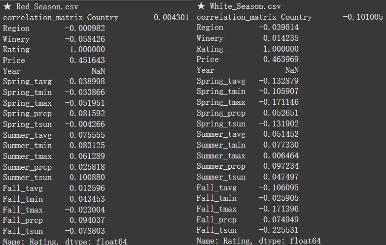
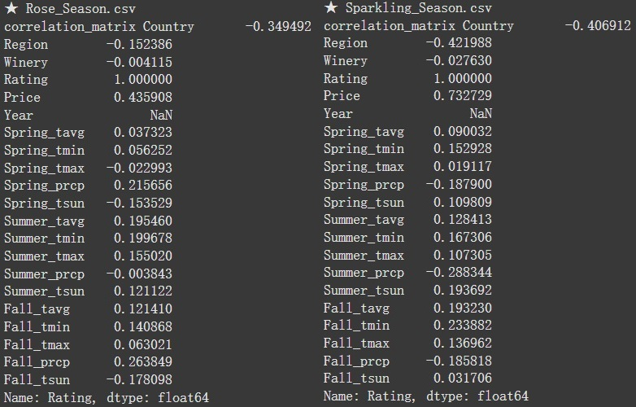
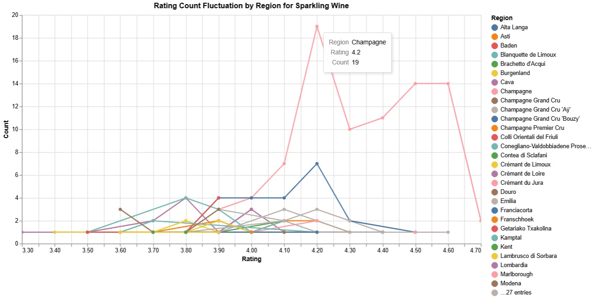

# 天、地、人：天氣變化如何影響葡萄酒的風味與品質  

## 摘要 (Abstract)

葡萄酒品質的影響因素通常歸納為「天、地、人」三大要素。「天」指的是氣候條件，包括陽光、溫度和降雨量等環境因素；「地」則代表葡萄生長的土壤類型、地形和地理位置，這些自然條件對葡萄的成熟和風味有深遠的影響；「人」則是指釀酒過程中，釀酒師的技術、選擇和經驗，從葡萄的採收到發酵和陳年方式都至關重要。這三者共同作用，決定了葡萄酒的品質和風味特徵。 

本研究旨在通過觀察葡萄產地的天氣變化，深入分析其對葡萄酒品質的影響，並進一步預測葡萄酒的品質。研究將重點放在氣候條件如溫度、降水量和日照時間等因素，如何在不同生長季節中影響葡萄的成熟度與風味，進而影響釀製出的葡萄酒品質。同時，本研究將應用數據分析和機器學習技術，建立預測模型，準確預測葡萄酒的品質。透過此分析，研究期望提供有助於葡萄農和釀酒師優化栽培及釀造策略的實用洞見，以提升葡萄酒的整體品質。 

## 引言 (Introduction)

葡萄酒的品質和風味深受多種因素影響，而在傳統釀酒理論中，這些因素常歸納為「天、地、人」三者。「天」代表氣候條件，包括陽光、溫度、降水等自然環境；「地」則指葡萄生長的土壤、地形與地理位置，影響葡萄的風味和成熟度；「人」則是釀酒師的技藝與經驗，從栽培到釀造的過程都決定了葡萄酒的最終品質。
其中，氣候變化對葡萄酒的影響尤為顯著。隨著全球氣候變遷，氣溫上升、降水模式改變，這些天氣因素直接影響了葡萄的生長週期、糖分含量以及酸度平衡，從而塑造了葡萄酒的風味特徵。現今，越來越多的研究試圖通過深入分析天氣數據，來預測葡萄酒的品質，並幫助釀酒師更好地適應氣候變化，提升釀酒技術。
本研究的目的是透過觀察和分析葡萄產區的氣候變化，探討天氣對葡萄酒品質的具體影響，並進一步建立預測模型，為未來的葡萄栽種與釀造策略提供參考依據。透過結合傳統「天、地、人」的釀酒理念，研究旨在找出氣候變化與葡萄酒風味之間的具體關聯性，以期在現代釀酒工藝中應用這些新發現，提升葡萄酒的整體品質與市場競爭力。

## 相關研究 (Related Work)

在葡萄酒品質與風味的研究中，現有文獻大致可分為兩個主要方向：一是通過分析葡萄酒的評論和評分，二是通過分析葡萄酒的成分來預測品質。
1. **透過評論和評分進行的研究：**
第一類研究著重於收集消費者對葡萄酒的評價，並使用這些數據建立機器學習模型來預測葡萄酒的評分。例如，某研究通過從 Vivino.com 抓取資料，創建了一個包含不同類型葡萄酒（紅酒、白酒、玫瑰酒和氣泡酒）的數據集，數據集包含八個特徵欄位，如評分數量、評分值和葡萄酒種類。研究者發現，由於一些葡萄酒的評分數量過少，評分可能缺乏代表性，從而難以反映其真實品質。基於這一點，研究者構建了機器學習模型，嘗試預測那些評分數量較少但具有潛力的葡萄酒的評分了消費者評價在葡萄酒市場中的重要性，並指出新產品往往因缺乏評價而無法獲得市場關注，導致潛在銷量損失。因此，預測葡萄酒評分模型不僅有助於消費者更好地選擇產品，還能幫助生產商提高新產品的曝光率和市場需求。
2. **透過成分分析進行的研究：**
另一類研究則側重於葡萄酒的物理和化學成分分析，以評估其品質和風味。這些研究通常通過分析葡萄酒的成分，如酒精含量（ABV）、葡萄品種、風味特徵、年份、產區等，來預測其最終品質。某研究中的數據集涵蓋來自世界各地的葡萄酒，詳細記錄了葡萄酒的名稱、描述、價格、葡萄品種、瓶塞類型、酒精含量、地區、風格及其風味特徵等。這類研究的目的是利用這些特徵來構建預測模型，評估葡萄酒的風味、香氣及市場價值 。
這類研究的析葡萄酒的成分，可以對其品質和市場價值進行更加精確的預測，這對葡萄酒生產商在市場定位和定價策略上具有重要意義。
綜上所述，無論是基於評論與評分，還是基於成分的分析，這兩種方向的研究均試圖通過數據驅動的方式來預測和提升葡萄酒的品質與市場表現。然而，這些研究大多集中於葡萄酒的結果評估，而對於影響葡萄生長的外部自然條件，如天氣變化，探討仍然不足。本研究旨在彌補這一空白，通過觀察葡萄生產地的氣候變化，來分析天氣如何影響葡萄酒的風味與品質，並建立相關的預測模型。

## 擬定計劃 (Proposed Work)

本研究旨在通過結合葡萄酒評分數據與氣象數據，探討天氣變化如何影響葡萄酒的風味與品質。具體來說，本研究將利用兩個包含不同產地葡萄酒的數據集（紅酒與白酒），並根據每個產地的地理位置，查詢當地的歷史天氣資料，進行相關分析。以下為本研究的具體步驟：
1. **數據集整合：**
研究將首先對兩個數據集進行清理與整合，確保數據的一致性與可用性。每個數據集包括葡萄酒名稱、國家、地區、酒莊名稱、評分（Rating）、評分數量（NumberOfRatings）、價格（Price）及年份（Year）等關鍵變數。這些變數將用於後續的統計分析和模型訓練。
2. **產地座標查詢：**
為了將葡萄酒產地與氣象數據進行匹配，本研究將基於數據集中提供的地區名稱，利用地理編碼技術查詢每個地區的經緯度座標。
3. **氣象站匹配與天氣數據獲取：**
接下來，本研究將使用產地的經緯度，查詢產地的歷史天氣數據。具體的天氣變數將包括：
    • 日平均溫度
    • 降雨量
    • 日照時數
      
這些天氣變數將對應到葡萄的生長季節，進一步分析它們對葡萄酒品質的影響。
4. 數據分析與模型建構：
在數據整合完成後，研究將運用統計分析方法和機器學習模型來探索天氣變量與葡萄酒評分之間的關聯性。具體分析步驟包括：
    • 相關性分析： 探討不同天氣變數（如溫度、降水量等）與葡萄酒評分之間的相關性。
    • 回歸模型： 建立多元回歸模型，分析天氣變數對葡萄酒評分的預測能力。
    • 機器學習模型： 使用隨機森林（Random Forest）機器學習方法，進行葡萄酒品質的預測。
5. 結果驗證與討論：
最後，研究將對模型的預測結果進行驗證與討論，分析天氣條件對葡萄酒品質的具體影響，並根據結果提出相應的釀酒與栽培建議。特別是，研究將強調如何根據氣候變化調整葡萄的種植和釀造技術，以提高葡萄酒的品質。
本研究的成果將有助於釀酒師和葡萄農理解天氣變化對葡萄酒品質的影響，並為未來應對氣候變化提供科學依據。

## 評估與驗證 (Evaluation and Validation)
### 相關係數

- 在相關係數分析中，我們針對不同葡萄酒類型（紅酒、白酒、玫瑰紅酒、氣泡酒）進行了關鍵特徵的評估。首先，價格在四種類型葡萄酒中均與評分呈現出顯著的正相關（0.44 至 0.73 不等），顯示出價格與品質之間的一致關聯。此外，不同的季節性氣候因素對各類型的葡萄酒評分產生了不同的影響。對於紅酒而言，夏季日照時間（0.10）和秋季降水量（0.09）具正向關聯，這表明在成長季中適量的日照與降水有助於提升紅酒的評分。 
- 在白酒中，秋季日照時間（-0.23）和春季最高氣溫（-0.17）與評分呈現負相關，顯示過度的日照或高溫可能會對白酒品質產生不利影響。對玫瑰紅酒而言，秋季降水量（0.26）和春季降水量（0.22）與評分呈正相關，指出在葡萄成長期的適量降水可能增進其風味和評分。
- 值得注意的是，氣泡酒的地區特徵與評分間的負相關性（-0.42）顯著，尤其是非香檳區的氣泡酒評分較低，突顯了香檳區在氣泡酒品質中的特殊地位。此外，氣泡酒的評分與秋季低溫（0.23）及夏季日照時間（0.19）呈正相關，說明穩定的氣候條件對維持氣泡酒的高品質具有重要作用。
- 總結來說，價格、地區和季節性氣候因素在不同類型葡萄酒的品質評分中扮演了關鍵角色，尤其是日照時間和降水量的季節性變化對不同葡萄酒類型的影響較為顯著。

### 模型評估
為了評估不同模型在葡萄酒品質預測上的表現，我們採用了 Lasso 回歸、主成分分析（PCA）、隨機森林 以及 深度學習 四種模型，並對各模型進行交叉驗證以確保其穩健性。以下是各模型的評估結果與比較：
- 效能指標：各模型主要依據均方誤差 (MSE) 來評估在四種類型葡萄酒（Red, White, Rose, Sparkling）上的表現
  - Lasso 回歸：MSE 分別為 0.094 / 0.067 / 0.066 / 0.082
  - PCA 模型：MSE 分別為 0.067 / 0.056 / 0.079 / 0.055
  - 隨機森林模型：MSE 分別為 0.068 / 0.055 / 0.091 / 0.049
  - 深度學習模型：MSE 分別為 0.040 / 0.057 / 0.287 / 0.285
    
  PCA 和隨機森林模型在大多數情況下的 MSE 表現優於 Lasso 和深度學習模型。特別是在數據特徵間線性關係較強的情況下，PCA 和隨機森林具有更穩定的預測效果，而深度學習模型雖具捕捉非線性關係的能力，但因數據特徵呈現線性關聯，效果不如預期。
  
- 計算效率：在處理效率上，隨機森林和 PCA 模型的計算速度較快，適合應對大量數據；而深度學習模型運算資源需求較高，運行速度較慢。儘管深度學習模型能夠捕捉更為複雜的非線性關係，但因本專案中的數據特徵具有較強的線性關聯，因此深度學習模型並未呈現顯著優勢。
- 交叉驗證：使用 5 折交叉驗證來評估模型的穩健性，各模型在四類葡萄酒（Red, White, Rose, Sparkling）的交叉驗證 MSE 為：
    - Lasso 回歸：0.090 / 0.062 / 0.080 / 0.071
    - PCA模型：0.071 / 0.056 / 0.079 / 0.055
    - 隨機森林：0.072 / 0.061 / 0.067 / 0.051

  結果顯示，隨機森林與 PCA 均具穩健的預測效果，並且在交叉驗證中表現出穩定性，適合應用於葡萄酒品質的預測。

## 特徵重要性分析
針對季節性天氣特徵的影響進行分析，我們綜合了三種回歸方法來識別影響葡萄酒評分的重要特徵：
- Lasso 回歸：選擇出主要影響特徵集中於日照時間 (tsun)，尤其是春季、夏季與秋季的日照時長。這可能是由於日照時間直接影響葡萄的成熟度與風味，進而影響到品質評分。
- PCA 主成分分析：春秋兩季的平均溫度 (tavg)、最高溫 (tmax)、與最低溫 (tmin) 對評分影響最大，解釋了約 35% 的變異量；夏季氣溫 (tavg/tmin/tmax) 和日照時間則次之，解釋了約 26% 的變異量。
- 隨機森林回歸：在不同葡萄酒類型中，夏秋季的日照時間對紅、白葡萄酒評分影響最大；春季日照時間及秋季降水量 (prcp) 對玫瑰酒的影響較大；夏季降水量對氣泡酒影響顯著。總體而言，溫度 (tavg/tmin/tmax) 對所有酒類的影響次於日照與降水。

## 資料可視化(Data Visualization)

1. **日照時間 (Sunshine Duration) vs. 評分**
    - 春季和夏季的日照時間顯示出，較長的日照時間（超過30,000秒）與高評分（4.4至4.8）呈現正相關。
    - 在秋季，不同日照時間對評分的影響相對均衡，未見明顯的趨勢，儘管紅酒在較長的日照下評分略高。
2. **平均氣溫 (Mean Temperature) vs. 評分**
    - 在春季和夏季，氣溫和評分的相關性較難發現明顯趨勢，氣溫範圍在5°C到25°C之間。
    - 秋季的氣溫對各類酒評分的影響似乎較均勻，且大多數評分集中在4.2至4.6之間。
3. **降水量 (Precipitation) vs. 評分**
    - 春季和夏季降水量較低時（約0至5mm），大部分類型的葡萄酒（特別是紅酒）評分略高，但超過一定降水量（>5mm）後，評分趨勢變得較為平坦。
    - 秋季降水量的變化對評分的影響也並不明顯，但當降水量低於5mm時，整體評分似乎稍高，尤其對紅酒的影響更為明顯。

## 時間規劃與挑戰 (Timeline and Challenges)
- 時間表設置：
  1. 資料整理與前處理：2 週
  2. 模型選擇與調整：2 週
  3. 交叉驗證與結果分析：1 週
  4. 報告撰寫與提交：1 週
- 挑戰預估：
  1. 資料特徵工程：不同季節的天氣數據之間存在高度的線性相關性，這會導致多重共線性問題，影響模型的準確性和解釋力。為了解決這個問題，我們使用了PCA 降維技術，並結合 Lasso 進行特徵選擇，篩選出與葡萄酒評分相關性最高的天氣特徵。 
  2. 運算資源：深度學習模型在訓練時需要更多的計算資源，尤其是處理較大的數據集時，計算時間顯著增加。應準備額外的運算資源以加快處理。

## 結論 (Conclusion)
本專案通過對天氣數據進行分析，成功地構建了幾個模型來預測葡萄酒的評分。經過比較，隨機森林回歸和主成分分析 (PCA) 模型在效能與計算資源之間取得了良好平衡，顯示出較低的 MSE 值。
在相關性分析中，可發現沒有單一特徵對Rating有高度相關性，只有Sparkling Wine的Region與Rating的相關性較高(0.42)，進行可視化觀察Rating與Region的關係，可發現香檳區的Rating明顯高於其他Region，因此導致高相關性
在天氣的特徵篩選中，綜合比較了三種回歸分析方法，結果如下：
- Lasso 回歸：
    - 日照時間 (tsun) 對葡萄酒評分具有較高的影響力。
- 主成分分析 (PCA)：
    - 春秋兩季的氣溫 (tavg/tmin/tmax) 具有較高的影響力，解釋了約 35% 的變異率。
    - 夏季的氣溫 (tavg/tmin/tmax) 與 日照時間 (tsun) 影響力次高，解釋了約 26% 的變異率。
- 隨機森林回歸：
    - 夏季和秋季的日照時間 (tsun) 對紅白葡萄酒評分影響顯著。
    - 春季日照時間 (tsun) 和 秋季降水 (prcp) 對玫瑰酒的影響較大。
    - 夏季降水 (prcp) 對氣泡酒的影響最大，佔據了最高權重。
    - 氣溫 (tavg/tmin/tmax) 對所有類型葡萄酒的影響次於日照和降水。

**總結：**
- **日照時間** 對所有類型的葡萄酒評分具有一致且重要的影響力，春季需要中等日照量(8 ~ 11小時)，夏季需要高等日照量(10 ~ 13小時)，秋季需要低等日照量(6 ~ 9小時)。
- **氣溫** 對於不同酒類的影響不明顯，但春秋兩季的氣溫對葡萄酒品質影響較明顯(5 ~ 20°C)，夏季氣溫對評分也有一定影響。
- **降水量** 對特定類型葡萄酒的評分有較強的關聯性，可以發現氣泡酒與玫瑰酒在夏季需要低等降水量(0 ~ 2mm)，秋季需要中等降水量(0.5 ~ 4mm)。

## 未來工作(Future Work)       
1. 分析氣候對葡萄生長的影響
氣候因素如溫度、降水量、日照時間等，直接影響葡萄的成熟度、糖分和酸度，這些都會影響葡萄酒的風味與品質。研究首先要建立氣候變化與葡萄品質的關係模型，像你已經採用的PCA分析和回歸模型，能幫助找到關鍵氣候變數（如春季、夏季和秋季的日照時間、降水等）與葡萄酒品質之間的相關性。
2. 氣候預測與葡萄園管理
透過氣象數據和長期的氣候預測，葡萄園可以提前採取措施來適應氣候變化。具體方法包括：
    - 調整種植區域：選擇適應當前氣候條件的葡萄品種，或將葡萄園移至更適合的地區。例如，氣候變暖可能適合將葡萄園移到海拔較高或氣溫較低的區域。
    - 調整種植時間：根據氣候變化，調整葡萄的生長週期，例如提早或延後種植時間，以避免在氣候極端條件（如夏季過高溫度）下進行成熟。
3. 釀造技術的調整
釀酒過程也可以根據葡萄特性的變化進行調整：
    - 發酵溫度控制：若葡萄糖分過高導致酒精含量過高，可以通過降低發酵溫度來減少過度發酵的風險，保持葡萄酒的平衡感。
    - 酸度調整：隨著氣候變暖，葡萄的酸度可能會降低。可以使用技術調整，如增加酸度補充劑，以保持葡萄酒的風味和口感。
    - 橡木桶熟成時間：根據葡萄的成熟度和氣候影響，調整葡萄酒在橡木桶中的熟成時間，以最佳化葡萄酒的香氣和結構。
4. 新技術和方法的應用
透過數據分析，葡萄園主和釀酒師可以採用新技術來應對氣候變化的挑戰：
    - 智慧農業技術：使用傳感器、無人機和人工智慧監測天氣和土壤狀況，精準管理葡萄園，實時調整水分和養分的供應。
    - 品種培育：透過選擇和培育適合當地氣候條件的耐熱、耐旱或高酸度的葡萄品種，以應對氣候變遷帶來的挑戰。
5. 長期數據的監測和調整策略
持續收集和分析氣象數據和葡萄酒品質評分，定期調整種植和釀造策略。隨著氣候變化加劇，長期的數據積累和持續改進是提高葡萄酒品質的重要手段。
6. 與科學研究機構合作
最後，可以與農業、氣象、釀造科學領域的研究機構合作，獲取最新的技術和研究成果，運用氣候模型與分析技術，為葡萄園的管理和釀造技術提供科學依據。
通過這些方式，研究能幫助制定具體的技術和管理措施，來應對氣候變化對葡萄生長和釀造過程的挑戰，提高葡萄酒的品質。
