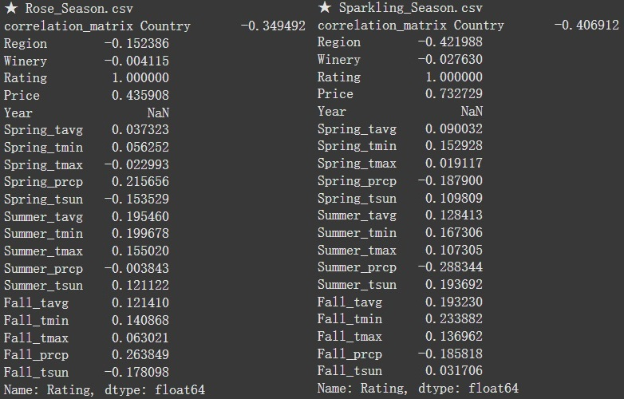
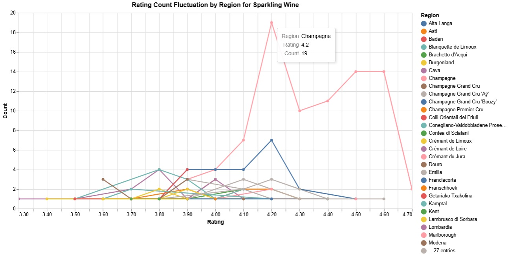
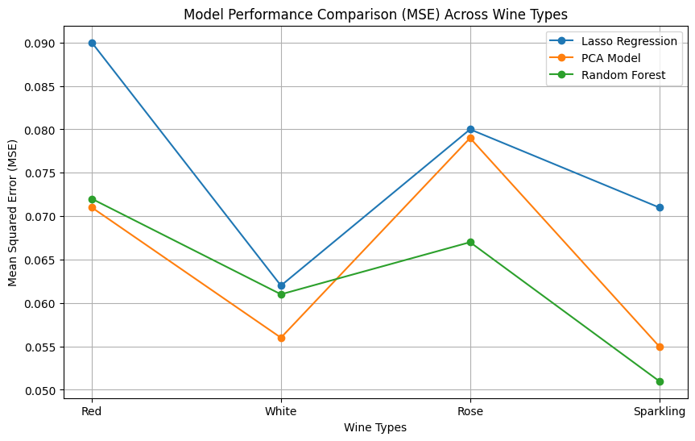

# Heaven, Earth, and Man: How Weather Changes Affect the Flavor and Quality of Wine

## Abstract

The quality of wine is commonly attributed to three key factors: heaven, earth, and man. Heaven refers to climatic conditions, including sunlight, temperature, and rainfall—environmental elements that play a crucial role in grape cultivation. Earth encompasses the type of soil, topography, and geographic location where the grapes are grown, all of which profoundly affect grape maturity and flavor. Man represents the winemaker’s skill, decisions, and expertise throughout the winemaking process, from harvest to fermentation and aging. Together, these three factors shape the overall quality and characteristics of wine.

This study aims to explore how weather variations in grape-growing regions influence the quality of wine and to develop models that predict wine quality. The research focuses on how climatic factors, such as temperature, precipitation, and sunlight duration, impact grape maturity and flavor during different growing seasons, ultimately affecting the wine’s quality. Through the application of data analysis and machine learning techniques, predictive models will be created to estimate wine quality with precision. The study aims to provide practical insights that can help grape growers and winemakers optimize their cultivation and production strategies to enhance the overall quality of wine.

## Introduction

The quality and flavor of wine are influenced by various factors, which are traditionally summarized as heaven (天), earth (地), and man (人) in winemaking theory. Heaven refers to climatic conditions such as sunlight, temperature, and rainfall—natural elements that play a crucial role in shaping grape growth. Earth refers to the soil, topography, and geographical location where the grapes are cultivated, which impact the grapes' flavor and ripeness. Man refers to the winemaker’s techniques and expertise, influencing every step from grape cultivation to the winemaking process and ultimately determining the final quality of the wine.

Among these factors, climate change has a particularly significant effect on wine. As global climate patterns shift—with rising temperatures and altered rainfall patterns—these weather changes directly impact the grape growing cycle, sugar content, and acidity balance, shaping the overall flavor profile of the wine. In recent years, more and more studies have aimed to analyze weather data to predict wine quality, helping winemakers adapt to climate changes and improve their winemaking techniques.

This study seeks to investigate how climate variations in grape-growing regions affect wine quality by observing and analyzing weather patterns. Additionally, the study will develop predictive models to provide insights for future grape cultivation and winemaking strategies. By integrating the traditional winemaking philosophy of heaven, earth, and man, the research aims to identify the specific connections between climate change and wine flavor, with the goal of applying these findings to modern winemaking practices to improve overall wine quality and competitiveness in the market.

## Related Work

In the study of wine quality and flavor, existing literature can be broadly categorized into two main directions: one focuses on analyzing wine reviews and ratings, and the other on analyzing the composition of wines to predict quality.

1. **Research Based on Reviews and Ratings：**
The first category of research focuses on collecting consumer evaluations of wine and using these data to build machine learning models to predict wine ratings. For example, one study scraped data from Vivino.com, creating a dataset that includes various types of wine (red, white, rosé, and sparkling), with features such as the number of ratings, rating scores, and wine type. The researchers found that for certain wines, the limited number of ratings led to a lack of representativeness, making it difficult to reflect their true quality. Based on this observation, they developed machine learning models to predict ratings for wines with fewer reviews but higher potential. This highlights the importance of consumer feedback in the wine market and indicates that new products often suffer from a lack of attention due to insufficient reviews, which can result in potential sales losses. Predicting wine ratings not only helps consumers make better purchasing decisions but also aids producers in increasing the visibility and market demand for new products.

3. **Research Based on Ingredient Analysis：**
The second category of research focuses on the physical and chemical composition of wine to assess its quality and flavor. These studies typically analyze the components of wine, such as alcohol content (ABV), grape varieties, flavor characteristics, vintage, and region, to predict its final quality. One study’s dataset included wines from around the world, documenting details such as wine name, description, price, grape variety, cork type, alcohol content, region, style, and flavor characteristics. The goal of this research was to build predictive models that could evaluate the flavor, aroma, and market value of wine based on these features. By analyzing the composition of wine, these studies provide more accurate predictions about its quality and market value, which is crucial for wine producers in terms of market positioning and pricing strategies.

In conclusion, whether based on reviews and ratings or ingredient analysis, both directions of research aim to use data-driven approaches to predict and enhance wine quality and market performance. However, most of these studies focus on evaluating the outcomes of the wine itself, while there has been less exploration into external natural conditions, such as weather changes, that affect grape growth. This study aims to fill that gap by analyzing how climate changes in grape-producing regions impact wine flavor and quality and by building predictive models based on these observations.

## Proposed Work

This study aims to explore how weather changes affect the flavor and quality of wine by integrating wine rating data with meteorological data. Specifically, the research will utilize two datasets containing wines from different regions (red and white wines) and, based on the geographic locations of each region, retrieve historical weather data for relevant analysis. The detailed steps of the study are as follows:

1. **Dataset Integration**
The study will begin by cleaning and integrating the two datasets to ensure data consistency and usability. Each dataset includes key variables such as wine name, country, region, winery name, rating, number of ratings, price, and year. These variables will be used for subsequent statistical analysis and model training.
2. **Geographical Coordinates Retrieval**
To match wine regions with meteorological data, the study will use the region names provided in the datasets and employ geocoding techniques to retrieve the latitude and longitude coordinates of each region.
3. **Weather Station Matching and Data Retrieval**
Next, using the latitude and longitude of the wine regions, the study will gather historical weather data from relevant weather stations. The specific weather variables to be collected include:
    • Daily average temperature
    • Rainfall
    • Daily sunlight hours
      
    These weather variables will correspond to the growing seasons of the grapes, and their impact on wine quality will be further analyzed.
4. **Data Analysis and Model Construction**
After integrating the data, the study will use statistical analysis and machine learning models to explore the relationship between weather variables and wine ratings. The specific analysis steps include:
    • Correlation Analysis: Investigate the correlation between different weather variables (e.g., temperature, rainfall) and wine ratings.
    • Regression Models: Build multiple regression models to analyze the predictive power of weather variables on wine ratings.
    • Machine Learning Models: Use Random Forest machine learning methods to predict wine quality based on weather conditions.
5. **Result Validation and Discussion**
Finally, the study will validate and discuss the prediction results of the models, analyzing the specific impact of weather conditions on wine quality. Based on these findings, recommendations will be made for adjusting winemaking and grape cultivation techniques to improve wine quality in response to climate changes.

The results of this study will assist winemakers and grape growers in understanding how weather changes affect wine quality, providing a scientific basis for adapting to future climate variations.

## Evaluation and Validation
### Correlation Analysis

In the correlation analysis, we evaluated key features for different types of wine (red, white, rosé, and sparkling). Firstly, price showed a significant positive correlation with ratings across all wine types (ranging from 0.44 to 0.73), indicating a consistent relationship between price and quality. Moreover, various seasonal climate factors impacted the ratings of each wine type differently.

- For red wine, summer sunlight hours (0.10) and autumn rainfall (0.09) were positively correlated with ratings, suggesting that moderate sunlight and rainfall during the growing season contribute to improved red wine ratings.
- For white wine, autumn sunlight hours (-0.23) and spring maximum temperature (-0.17) exhibited negative correlations with ratings, highlighting that excessive sunlight or high temperatures may negatively affect white wine quality.
- For rosé wine, autumn rainfall (0.26) and spring rainfall (0.22) were positively correlated with ratings, indicating that moderate rainfall during the grape growing period can enhance flavor and ratings.
- Notably, sparkling wine showed a significant negative correlation between regional characteristics and ratings (-0.42), particularly for sparkling wines produced outside the Champagne region, emphasizing the unique role of the Champagne region in sparkling wine quality. Furthermore, sparkling wine ratings positively correlated with autumn low temperatures (0.23) and summer sunlight hours (0.19), indicating that stable climate conditions are essential for maintaining high-quality sparkling wines.

In summary, price, region, and seasonal climate factors play critical roles in determining wine ratings across different types. Seasonal variations in sunlight hours and rainfall, in particular, have distinct impacts on the quality of various wine types.

### Model Evaluation
To evaluate the performance of different models in predicting wine quality, we used Lasso regression, principal component analysis (PCA), random forest, and deep learning models, and performed cross-validation to ensure their robustness. The following are the evaluation results and comparisons of each model:

- Performance indicators: Each model was primarily evaluated based on mean squared error (MSE) in predicting the quality of four types of wine (Red, White, Rose, Sparkling).
  - Lasso Regression:  0.094 / 0.067 / 0.066 / 0.082
  - PCA: 0.067 / 0.056 / 0.079 / 0.055
  - Random Forest: 0.068 / 0.055 / 0.091 / 0.049
  - Deep Learning: 0.040 / 0.057 / 0.287 / 0.285

  PCA and random forest models generally outperformed Lasso and deep learning models in terms of MSE. Particularly, PCA and random forest models showed more stable prediction effects when the data features exhibited strong linear relationships, while deep learning models, despite their ability to capture nonlinear relationships, did not perform as expected due to the strong linear associations among the data features.

- Computational Efficiency: In terms of processing efficiency, random forest and PCA models are faster and more suitable for handling large amounts of data, while deep learning models require higher computational resources and run slower. Although deep learning models can capture more complex nonlinear relationships, due to the strong linear associations among the data features in this project, deep learning models did not show significant advantages.
- Cross-validation: Using 5-fold cross-validation to evaluate the robustness of the models, the MSEs of the models in the four types of wine (Red, White, Rose, Sparkling) were:
    - Lasso Regression: 0.090 / 0.062 / 0.080 / 0.071
    - PCA: 0.071 / 0.056 / 0.079 / 0.055
    - Random Forest: 0.072 / 0.061 / 0.067 / 0.051

  The results show that both random forest and PCA models have robust prediction effects and stability in cross-validation, making them suitable for predicting wine quality.
  

## Feature Importance Analysis

To analyze the impact of seasonal weather features on wine ratings, we combined three regression methods to identify the important features affecting wine ratings:

- Lasso Regression: The main influencing features were concentrated on sunshine duration (tsun), especially the sunshine duration in spring, summer, and autumn. This may be due to the direct impact of sunshine duration on grape maturity and flavor, thereby affecting the quality rating.
- PCA: The average temperature (tavg), maximum temperature (tmax), and minimum temperature (tmin) in spring and autumn explained about 35% of the variation, and the temperature in summer and sunshine duration explained about 26% of the variation.
- Random Forest Regression: In different wine types, the sunshine duration in summer and autumn had the greatest impact on red and white wine ratings; the sunshine duration in spring and the autumn rainfall (prcp) had a greater impact on rose wine; and the summer rainfall had a significant impact on sparkling wine. Overall, temperature (tavg/tmin/tmax) had a lower influence than sunshine and precipitation.

## Data Visualization

1. **Sunshine Duration vs. Rating**
    - The sunshine duration in spring and summer showed a positive correlation with high ratings (4.4 to 4.8) when the duration was longer than 30,000 seconds.
    - In autumn, the influence of different sunshine durations on ratings was relatively balanced, with no obvious trends. However, red wine ratings tended to be higher when the sunshine duration was longer.

2. **Mean Temperature vs. Rating**
    - In spring and summer, the correlation between temperature and rating was not obvious, with temperatures ranging from 5°C to 25°C.
    - In autumn, the temperature had a relatively uniform influence on the ratings of different types of wine, with most ratings concentrated between 4.2 and 4.6.

3. **Precipitation vs. Rating**
    - When the precipitation in spring and summer was low (about 0 to 5mm), the ratings of most types of wine (especially red wine) tended to be slightly higher. However, when the precipitation exceeded a certain amount (>5mm), the rating trend became relatively flat.
    - The change in autumn precipitation had no obvious effect on ratings, but when the precipitation was less than 5mm, the overall ratings seemed slightly higher, with a more pronounced effect on red wine.

## Timeline and Challenges
- Timeline:
  1. Data Cleaning and Preprocessing: 2 weeks
  2. Model Selection and Adjustment: 2 weeks
  3. Cross-validation and Result Analysis: 1 week
  4. Report Writing and Submission: 1 week
- Challenges:
  1. Data Feature Engineering: There is a high degree of linear correlation between weather data for different seasons, which can lead to multicollinearity issues and affect the accuracy and interpretability of the models. To address this problem, we used PCA dimensionality reduction techniques and combined it with Lasso for feature selection, screening out the weather features most highly correlated with wine ratings.
  2. Computational Resources: Deep learning models require more computational resources, especially when processing larger datasets, significantly increasing computation time. It is recommended to prepare additional computational resources to speed up processing.

## Conclusion
This project successfully constructed several models to predict wine ratings by analyzing weather data. After comparing the performance of different models, the Random Forest Regression and Principal Component Analysis (PCA) models achieved a good balance between performance and computational resources, showing lower MSE values.

In the correlation analysis, it was found that no single feature had a high correlation with ratings. The only feature with a relatively high correlation with ratings was the region for Sparkling Wine (0.42). Through visualization, it was observed that the ratings in the Champagne region were significantly higher than in other regions, which likely contributed to the high correlation.

In the feature selection for weather, the results of three regression analysis methods were compared as follows:

- Lasso Regression:
    - Sunshine duration (tsun) had a higher impact on wine ratings.
- Principal Component Analysis (PCA):
    - The average temperature (tavg), minimum temperature (tmin), and maximum temperature (tmax) in spring and autumn explained about 35% of the variation, and the temperature in summer and sunshine duration explained about 26% of the variation.
- Random Forest Regression:
    - Sunshine duration (tsun) in summer and autumn had a significant impact on red and white wine ratings.
    - Sunshine duration (tsun) in spring and autumn had a greater impact on rose wine.
    - Summer rainfall (prcp) had the greatest impact on sparkling wine, accounting for the highest weight.
    - Temperature (tavg/tmin/tmax) had a lower influence than sunshine and precipitation.

**Conclusion:**
- **Sunshine duration** had a consistent and important impact on the ratings of all types of wine, requiring moderate sunshine in spring (8 ~ 11 hours), high sunshine in summer (10 ~ 13 hours), and low sunshine in autumn (6 ~ 9 hours).
- **Temperature** had no obvious effect on different types of wine, but the temperature in spring and autumn had a more significant impact on wine quality (5 ~ 20°C), and the temperature in summer also had a certain impact on ratings.
- **Precipitation** has a strong correlation with the ratings of specific types of wine. It was found that sparkling wine and rosé wine require low levels of rainfall (0 ~ 2mm) in summer and moderate levels of rainfall (0.5 ~ 4mm) in autumn.

## Future Work     
1. **Analysis of the impact of climate on grape growth**
Climate factors such as temperature, rainfall, and sunlight hours directly affect the maturity, sugar content, and acidity of grapes, all of which influence the flavor and quality of wine. Future research should first establish a model of the relationship between climate change and grape quality. Techniques like the PCA analysis and regression models you have already used can help identify key climate variables (e.g., sunlight hours and rainfall during spring, summer, and autumn) that correlate with wine quality.
2. Climate Prediction and Vineyard Management
Using meteorological data and long-term climate predictions, vineyards can take proactive measures to adapt to climate changes. Specific methods include:
    - Adjusting Planting Areas: Selecting grape varieties suited to current climate conditions or relocating vineyards to more suitable regions. For instance, climate warming might make higher-altitude or cooler-temperature areas more favorable for vineyards.
    - Adjusting Planting Times: Modifying the grape growth cycle, such as advancing or delaying planting times, to avoid extreme climate conditions (e.g., excessive heat during summer) during maturation.
3. Adjustments in Winemaking Techniques
The winemaking process can also be adjusted based on changes in grape characteristics:
    - Fermentation Temperature Control: If excessive grape sugar leads to higher alcohol content, lowering fermentation temperatures can mitigate the risk of over-fermentation, maintaining the balance of the wine.
    - Acidity Adjustment: As climate warming may reduce grape acidity, techniques such as adding acid supplements can help preserve the wine’s flavor and palate.
    - Oak Barrel Aging Time: Depending on grape maturity and climate impact, adjusting the aging time in oak barrels can optimize the wine's aroma and structure.
4. Application of New Technologies and Methods
Through data analysis, vineyard owners and winemakers can adopt new technologies to address challenges posed by climate change:
    - Smart Agriculture Technologies: Utilizing sensors, drones, and artificial intelligence to monitor weather and soil conditions, enabling precise vineyard management and real-time adjustments in water and nutrient supply.
    - Varietal Breeding: Selecting and cultivating grape varieties that are resistant to heat, drought, or high acidity to meet the challenges of climate change.
5. Monitoring Long-Term Data and Adjusting Strategies
Continuously collecting and analyzing meteorological data and wine quality ratings allows for periodic adjustments to planting and winemaking strategies. As climate change intensifies, long-term data accumulation and continuous improvements are essential for enhancing wine quality.
6. Collaboration with Scientific Research Institutions
Finally, partnering with research institutions in the fields of agriculture, meteorology, and enology can provide access to the latest technologies and research findings. Leveraging climate models and analytical techniques can offer scientific support for vineyard management and winemaking processes.

By implementing these strategies, the research can help develop specific technical and management measures to address the challenges of climate change on grape growing and winemaking, ultimately improving wine quality.
